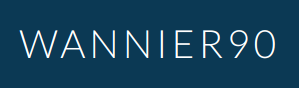
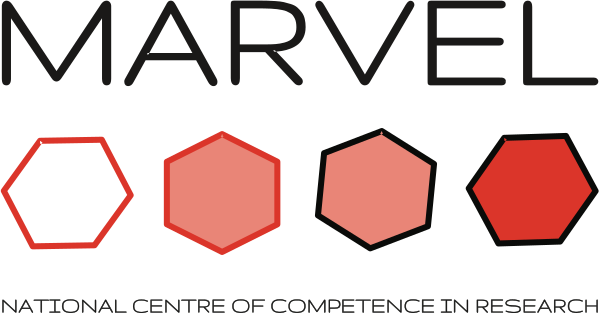

######################################
Advanced AiiDA workflows for Wannier90
######################################

The |aiida-wannier90-workflows|_ package is an `AiiDA`_ plugin for running advanced workflows with the `wannier90`_ software suite.

.. rst-class:: center

    |aiida_logo| |hyphen| |w90_logo|

.. |aiida_logo| image:: images/AiiDA_transparent_logo.png
    :width: 40%

.. |qe_logo| image:: images/qe_logo.jpg
    :width: 40%

Installation
============

You can install ``aiida-wannier90-workflows`` in your Python environment using ``pip``:

.. code-block:: console

   $ pip install aiida-wannier90-workflows

Note that this command will also install the ``aiida-core``, ``aiida-quantumespresso``, ``aiida-wannier90`` packages as its dependencies.
For more information on how to install AiiDA and the required services in different environments, we refer to the |aiida-core documentation|_.

Compatibility
=============
For an overview of the plugin's compatibility with Python, AiiDA and wannier90, please refer to the |README.md of the repository|_.

Getting Started
===============

A good place to get started with running `Quantum ESPRESSO`_ calculations using AiiDA is the `AiiDA Quantum ESPRESSO tutorial`_ on the main AiiDA tutorials page.
You can either run the tutorial in your own installation if completed, or use the resources mentioned there, i.e. the `Quantum Mobile`_ virtual machine.

.. warning::

   The documentation is currently undergoing a major revision, but likely still contains some outdated content.
   If you find any material that you think is incorrect, please `open an issue <https://github.com/aiidateam/aiida-wannier90-workflows/issues/new/choose>`_ on the GitHub repository.

Contents
========

.. toctree::
   :maxdepth: 2

   user_guide/index
   module_guide/index
   cli/index
   developer_guide/index

Indices and tables
==================

* :ref:`genindex`
* :ref:`modindex`
* :ref:`search`

Acknowledgements
================

If you use this plugin and/or AiiDA for your research, please cite the following work:

* Sebastiaan. P. Huber, Spyros Zoupanos, Martin Uhrin, Leopold Talirz, Leonid Kahle, Rico Häuselmann, Dominik Gresch, Tiziano Müller, Aliaksandr V. Yakutovich, Casper W. Andersen, Francisco F. Ramirez, Carl S. Adorf, Fernando Gargiulo, Snehal Kumbhar, Elsa Passaro, Conrad Johnston, Andrius Merkys, Andrea Cepellotti, Nicolas Mounet, Nicola Marzari, Boris Kozinsky, and Giovanni Pizzi, |AiiDA main paper|_, Scientific Data **7**, 300 (2020)

* Martin Uhrin, Sebastiaan. P. Huber, Jusong Yu, Nicola Marzari, and Giovanni Pizzi, |AiiDA engine paper|_, Computational Materials Science **187**, 110086 (2021)

.. rst-class:: bigfont

    We acknowledge support from:

.. list-table::
    :widths: 60 40
    :class: logo-table
    :header-rows: 0

    * - The `NCCR MARVEL`_ funded by the Swiss National Science Foundation.
      - |marvel|
    * - The EU Centre of Excellence "`MaX – Materials Design at the Exascale`_" (Horizon 2020 EINFRA-5, Grant No. 676598).
      - |max|
    * - The `swissuniversities P-5 project "Materials Cloud"`_.
      - |swissuniversities|

.. |max| image:: images/MaX.png
    :width: 100%

.. |swissuniversities| image:: images/swissuniversities.png
    :width: 100%

.. |aiida-core documentation| replace:: ``aiida-core`` documentation
.. _aiida-core documentation: https://aiida.readthedocs.io/projects/aiida-core/en/latest/intro/get_started.html

.. |aiida-quantumespresso documentation| replace:: ``aiida-quantumespresso`` documentation
.. _aiida-quantumespresso documentation: https://aiida.readthedocs.io/projects/aiida-quantumespresso/en/latest/intro/get_started.html

.. |aiida-wannier90 documentation| replace:: ``aiida-wannier90`` documentation
.. _aiida-wannier90 documentation: https://aiida.readthedocs.io/projects/aiida-wannier90/en/latest/intro/get_started.html

.. |aiida-wannier90-workflows| replace:: ``aiida-wannier90-workflows``
.. _aiida-wannier90-workflows: https://github.com/aiidateam/aiida-wannier90-workflows

.. _AiiDA Quantum ESPRESSO tutorial: https://aiida-tutorials.readthedocs.io/en/tutorial-qe-short/

.. _AiiDA: http://aiida.net
.. _Quantum ESPRESSO: http://www.quantumespresso.org
.. _wannier90: http://www.wannier.org
.. _Quantum Mobile: https://quantum-mobile.readthedocs.io/en/latest/index.html

.. |AiiDA main paper| replace:: *AiiDA 1.0, a scalable computational infrastructure for automated reproducible workflows and data provenance*
.. _AiiDA main paper: https://doi.org/10.1038/s41597-020-00638-4

.. |AiiDA engine paper| replace:: *Workflows in AiiDA: Engineering a high-throughput, event-based engine for robust and modular computational workflows*
.. _AiiDA engine paper: https://doi.org/10.1016/j.commatsci.2020.110086

.. _NCCR MARVEL: http://nccr-marvel.ch/
.. _MaX – Materials Design at the Exascale: http://www.max-centre.eu/
.. _`swissuniversities P-5 project "Materials Cloud"`: https://www.materialscloud.org/swissuniversities

.. |README.md of the repository| replace:: ``README.md`` of the repository
.. _README.md of the repository: https://github.com/aiidateam/aiida-wannier90-workflows/blob/develop/README.md
